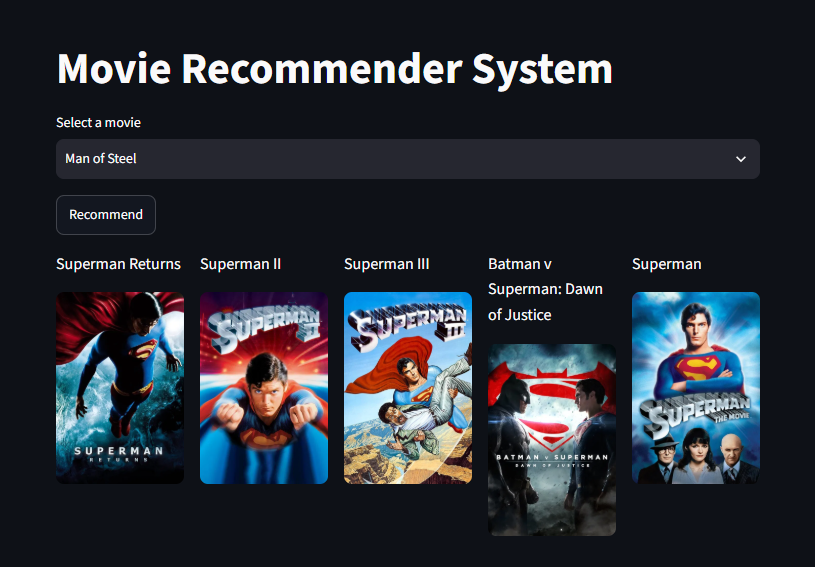

# 🎬 Movie Recommender System

A **content-based movie recommendation system** built with Python, NLP, Machine Learning, and Streamlit.

It recommends the **top 5 movies similar to a selected movie** using movie overview, genres, keywords, cast, and crew. Movie information is converted into numerical vectors using **CountVectorizer**, and similarity is calculated using **Cosine Similarity**.

### 🌐 Live Demo

[Movie Recommender System](https://movie-recommender-systemkr.streamlit.app/)


## 🖥️ Application Preview



---

## ✨ Features

* 🎬 Content-based movie recommendations
* 🧠 NLP-based text processing
* 🔢 CountVectorizer with 5,000 features
* 📐 Cosine Similarity
* 🌟 Top 5 similar movie recommendations
* ⚡ Precomputed similarity matrix using Joblib
* 🖥️ Interactive Streamlit interface
* ☁️ Deployed online

---

## 🧠 How It Works

```text
TMDB Movies + Credits
        ↓
Data Preprocessing
        ↓
Feature Engineering
        ↓
Create Movie Tags
        ↓
Lowercasing + Stemming
        ↓
CountVectorizer
        ↓
Cosine Similarity
        ↓
Top 5 Recommendations
        ↓
Streamlit App
```

The recommendation model combines:

* Movie overview
* Genres
* Keywords
* Cast
* Crew

into a single `tags` feature.

---

## 📊 Dataset

This project uses the **TMDB 5000 Movie Dataset**:

```text
tmdb_5000_movies.csv
tmdb_5000_credits.csv
```

After preprocessing, approximately **4,806 movie records** are available.

---

## 🛠️ Tech Stack

| Technology   | Purpose                      |
| ------------ | ---------------------------- |
| Python       | Core programming             |
| Pandas       | Data processing              |
| NumPy        | Numerical operations         |
| Scikit-learn | Vectorization & similarity   |
| NLTK         | Stemming                     |
| Joblib       | Model serialization          |
| Streamlit    | Web application              |
| Git/GitHub   | Version control & deployment |

---

# 🚀 Installation

## 1. Clone the Repository

```bash
git clone https://github.com/krishnalad17/Movie-Recommender-System.git
cd Movie-Recommender-System
```

## 2. Create Virtual Environment

### Windows

```bash
python -m venv venv
venv\Scripts\activate
```

### Linux / macOS

```bash
python3 -m venv venv
source venv/bin/activate
```

## 3. Install Dependencies

```bash
pip install -r requirements.txt
```

Or install manually:

```bash
pip install pandas numpy scikit-learn nltk streamlit joblib
```

## 4. Run the Application

```bash
streamlit run app.py
```

The application will open at:

```text
http://localhost:8501
```

---

## 📁 Project Structure

```text
Movie-Recommender-System/
│
├── app.py
├── Movie_Recommender_System.ipynb
├── similarity.pkl
├── movie_dict.pkl
├── requirements.txt
├── README.md
│
└── screenshots/
    ├── home.png
```

---

## 🎯 Example

Input:

```text
Shutter Island
```

Example recommendations:

```text
1. Angels & Demons
2. Gone Girl
3. Regression
4. Winter's Tale
5. The Girl with the Dragon Tattoo
```

---

## 📐 Machine Learning Approach

### CountVectorizer

Movie tags are converted into numerical vectors:

```python
cv = CountVectorizer(
    max_features=5000,
    stop_words='english'
)
```

### Cosine Similarity

Similarity between movies is calculated using:

```python
similarity = cosine_similarity(vectors)
```

The movies with the highest similarity scores are selected as recommendations.

---

## 💾 Model

The similarity matrix is saved using Joblib:

```python
joblib.dump(similarity, 'similarity.pkl')
```

This prevents the application from recalculating the entire similarity matrix every time it starts.

---

## 🚀 Future Improvements

* 🎞️ Movie posters
* ⭐ Ratings and reviews
* 🔎 Movie search/autocomplete
* 📊 Similarity scores
* 🧑‍🤝‍🧑 Collaborative filtering
* 🤖 Hybrid recommendation system
* 🧠 TF-IDF / sentence embeddings
* 🎥 Trailer integration

---

## 🎓 What I Learned

This project helped me practice:

* Data preprocessing
* Feature engineering
* NLP
* Text vectorization
* Stemming
* Cosine similarity
* Recommendation systems
* Model serialization
* Streamlit development
* Git/GitHub
* ML deployment

---

## 👨‍💻 Author

**Krishna Lad**

Computer Engineering Student

Interested in **Machine Learning, Artificial Intelligence, Data Science, Python, and Recommendation Systems.**

---

⭐ If you found this project useful, consider giving the repository a star!
